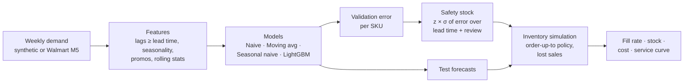

# 📦 Demand Forecasting & Safety Stock Optimisation

### ▶ [Open the live dashboard](https://<your-username>.github.io/demand-forecasting-safety-stock/)

**Better forecasts, less stock, same service.** A machine learning forecast for weekly SKU demand,
linked to a safety stock policy and an inventory simulation, so the result is measured in what a
supply chain actually cares about: units of stock, fill rate, and cost.

    

---

## The business problem

Many planning teams still forecast with moving averages in Excel. A moving average reacts late to
promotions, festive peaks and seasonality, so its forecast error is large. Planners cover that error
with **safety stock**, which ties up cash and warehouse space and raises E&O risk.

This project asks one question: **if the forecast gets better, how much safety stock can we release
without hurting service?**

## Results

Test period: 26 weeks never seen during training · 200 SKUs · 3-week lead time + weekly review ·
95% service target. The baseline is a moving average, standing in for current Excel practice.

| Metric | Moving average (baseline) | LightGBM | Change |
|---|---|---|---|
| Forecast error (WAPE) | 33.0% | **30.0%** | −9.1% |
| Forecast bias | +1.0% | −1.7% | both within ±2% |
| Safety stock needed | 45,980 units | **33,357 units** | **−27.5%** |
| Fill rate | 98.4% | 97.7% | −0.7 pts |
| Holding + stockout cost | 277,219 | **209,456** | **−24.4%** |
| **Stock needed for the same 98.4% fill rate** | 48,880 units | ≈40,400 units | **−17.3%** |

The last row is the fairest comparison: at the **same** fill rate, the better forecast needs about
**17% less inventory**.

**Where it helps most:** Personal Care, the most promotion-driven category, drops from 37.9% to 30.9% WAPE
(−18%), because the model learns promotion uplift and the post-promotion dip. Intermittent slow movers
stay hard for every method (82–106% WAPE), which is normal and reported separately.

**Disruption scenario:** with lead time stretched to 6 weeks and a 98% service target (think port
closure or supplier delay), the gap widens: **37% less stock for the same fill rate**
([scenario summary](reports/scenarios/lt6-sl98/summary.md)). Better forecasts matter most when supply
is under stress.

<p align="center">
  
  
</p>
<p align="center">
  
</p>

> All numbers are generated by `python -m dfss run` and copied from [`reports/summary.md`](reports/summary.md).
> They come from a synthetic dataset built to behave like FMCG demand (see [Data](#data)). No company data is used.

## How it works



### 1. Time split, no peeking
`train → validation (26 wks) → test (26 wks)`, always in time order. Models are fitted on train to
forecast validation, then refitted on train + validation to forecast test. Test weeks are never used
for fitting, tuning or setting safety stock.

### 2. Features a planner could actually know
Orders are placed 4 weeks ahead (3-week lead time + 1-week review), so every feature for week *w* uses
demand from week *w − 4* or earlier: lagged demand, same week last year, 4- and 12-week rolling mean
and volatility, share of zero weeks, week of year, and planned promotion flags (known in advance).
A dedicated test scrambles recent demand and fails if any feature changes.

### 3. Models
| Model | What it represents |
|---|---|
| Naive | "Next month looks like last known week" |
| **Moving average (8 wks)** | **Typical Excel planning, the baseline** |
| Seasonal naive | "Same week last year" |
| LightGBM | One global model across all SKUs, Tweedie loss for count-like demand |

### 4. From forecast error to safety stock
For each SKU and model, safety stock is set from the error that model actually made on the
validation weeks, summed over the 4-week protection period:

```
SS = z × std( rolling 4-week sum of (actual − forecast) )      z = 1.645 for 95%
```

A more accurate model earns a smaller buffer. This is the forecast-error method, which is more
appropriate than demand standard deviation once a forecast drives replenishment.

### 5. Inventory simulation
A weekly periodic-review, order-up-to policy runs over the 26 test weeks for every SKU:
`order = max(0, forecast over lead time + review + SS − inventory position)`. Unmet demand is lost.
The simulation is repeated for service targets from 80% to 99% to draw the service-vs-inventory curve.

## Quickstart

```bash
git clone https://github.com/<your-username>/demand-forecasting-safety-stock.git
cd demand-forecasting-safety-stock
python -m venv .venv && source .venv/bin/activate        # Windows: .venv\Scripts\activate
pip install -e ".[app,dev]"

python -m dfss run                  # ~10 s: forecasts, simulation, charts -> reports/
python -m pytest -q                 # 21 tests
streamlit run app/streamlit_app.py  # interactive dashboard
```

Everything is controlled from [`config.yaml`](config.yaml): lead time, service target, horizon,
models, number of SKUs, LightGBM settings.

### Dashboards
There are two versions of the same planner dashboard: pick a category and SKU, compare forecasts
against actuals, and move a service level slider to see safety stock, stock on hand, weeks of cover
and lost units update live.

- **Web version (GitHub Pages):** a single static page. The safety stock and ordering simulation are
  ported to JavaScript and give the same results as the Python code (checked to within rounding), so
  the slider works with no server. Build it locally with `python -m dfss site`, then open `site/index.html`.
- **Streamlit version:** `streamlit run app/streamlit_app.py` for local analysis in Python.

## Deploy to GitHub Pages

GitHub Pages only serves static files, so it cannot run Python itself. The workflow in
[`.github/workflows/pages.yml`](.github/workflows/pages.yml) does the work on every push to `main`:

1. installs the package and runs all tests, including the leakage checks,
2. runs the full pipeline in GitHub's cloud to produce fresh results,
3. builds the static dashboard from those results,
4. publishes it to GitHub Pages.

One-time setup:

1. Push this repo to GitHub (public repo for free Pages).
2. Go to **Settings → Pages → Build and deployment → Source** and choose **GitHub Actions**.
3. Push to `main`, or open the **Actions** tab and run *Deploy dashboard to GitHub Pages*.
4. After about 2 minutes the site is live at `https://<your-username>.github.io/<repo-name>/`.
   Put that link at the top of this README and on your CV.

## Data

**Default: synthetic FMCG demand** (no download). 200 SKUs over 182 weeks in four categories (Food,
Household, Personal Care, Slow Movers) with trend, yearly seasonality, an Oct–Nov festive peak,
planned promotions with uplift and a post-promo dip, over-dispersed noise, and intermittent slow movers.

**Real data: Walmart M5** (Kaggle). Set `data.source: m5` in `config.yaml` after downloading the files;
see [`data/README.md`](data/README.md). The loader converts daily sales to weekly and derives promo
weeks from price cuts.

## Built with Claude Code

This repo is set up so an AI coding agent can work on it safely, with guardrails that protect the
things that matter most in forecasting: no data leakage and no invented numbers. Every Claude Code
component below was checked with `claude plugin validate`.

```
.
├── AGENTS.md                         # shared rules for any coding agent (tool-agnostic)
├── CLAUDE.md                         # imports AGENTS.md + Claude-specific workflow
├── .claude/
│   ├── settings.json                 # permissions + hooks
│   ├── hooks/
│   │   ├── check_python.py           # PostToolUse: compile + run tests after every edit
│   │   └── session_context.py        # SessionStart: load latest results into context
│   ├── skills/
│   │   ├── run-pipeline/             # /run-pipeline: run + planner readout + sanity checks
│   │   ├── add-forecast-model/       # /add-forecast-model: safe, tested model additions
│   │   └── what-if/                  # /what-if 6 0.98: lead-time / service scenarios
│   └── agents/
│       └── leakage-auditor.md        # read-only subagent that audits for data leakage
├── .claude-plugin/marketplace.json   # makes this repo installable as a plugin marketplace
└── plugins/supply-chain-planning/    # reusable plugin for ANY supply chain project
    ├── .claude-plugin/plugin.json
    ├── skills/
    │   ├── supply-chain-metrics/     # KPI definitions (WAPE, bias, fill rate, CSL, E&O…)
    │   ├── safety-stock-calculator/  # bundled Python calculator script
    │   └── exec-summary/             # one-page leadership summary
    └── agents/
        └── demand-planning-reviewer.md
```

| Component | What it does here | Why it matters |
|---|---|---|
| **AGENTS.md + CLAUDE.md** | Project map, commands, seven hard rules, definition of done. `CLAUDE.md` imports `AGENTS.md` with `@AGENTS.md`, so Claude, Codex and Cursor share one source of truth. | Consistent behaviour across tools and sessions. |
| **Skills** | `/run-pipeline`, `/add-forecast-model`, `/what-if`. Frontmatter uses `argument-hint`, named `arguments`, `allowed-tools` and `${CLAUDE_SKILL_DIR}` for a bundled script. | Repeatable workflows instead of re-typing long prompts. |
| **Subagent** | `leakage-auditor` has read-only tools and a 7-point checklist. | An independent reviewer for the most common, most costly forecasting bug. |
| **Hooks** | After any edit, the edited Python file is compiled and the test suite runs; a failure is sent back to Claude (exit code 2). At session start, the latest headline numbers are loaded. | Deterministic guardrails, not just instructions. |
| **Permissions** | Pipeline and tests are pre-approved; Edit/Write to `reports/` is **denied**. | Results can only come from running the pipeline, never from hand-editing. |
| **Plugin + marketplace** | Domain skills and a reviewer agent packaged for reuse in other repos. | Shows how team know-how becomes a shareable tool. |

### Try it

```bash
npm install -g @anthropic-ai/claude-code
cd demand-forecasting-safety-stock && claude
```

Then, inside Claude Code:

```text
/run-pipeline
/what-if 6 0.98
/add-forecast-model croston
> Use the leakage-auditor to review my last change
/plugin marketplace add ./
/plugin install supply-chain-planning@supply-chain-toolkit
/supply-chain-planning:safety-stock-calculator 500 a week, std 150, 4 week lead time, 98% service
/supply-chain-planning:exec-summary reports/summary.md
```

## Project structure

```
src/dfss/
├── data.py        # synthetic generator + M5 loader, one tidy output format
├── features.py    # leakage-safe features
├── models.py      # model registry with a common fit/predict interface
├── metrics.py     # WAPE, bias, MAE, RMSE
├── inventory.py   # safety stock + order-up-to simulation
├── pipeline.py    # split, forecast, score, simulate, write reports
├── charts.py      # README / dashboard charts
├── site.py        # builds the static GitHub Pages dashboard
├── site_template.html  # dashboard page with the simulation ported to JavaScript
└── __main__.py    # CLI: python -m dfss run
app/streamlit_app.py
.github/workflows/  # ci.yml (tests) + pages.yml (run pipeline, deploy dashboard)
tests/             # metrics, inventory, leakage, data loaders, end-to-end smoke test
reports/           # generated outputs (CSV, PNG, summary.md, run_meta.json)
```

## Limitations and next steps

- **Synthetic data.** The data is realistic by design, not real. Next: run on Walmart M5 and publish those numbers.
- **Service slightly below target for LightGBM** (average cycle service level 93.9% vs a 95% target): validation error
  underestimates test error a little. Next: calibrate sigma on a longer window or use quantile forecasts directly.
- **Simplified supply side.** Fixed lead times, no MOQs, pack sizes, capacity or shelf life. Next: stochastic lead
  times and MOQ rounding.
- **Single-echelon.** One stocking point per SKU. Next: a DC-to-store network.
- **No hierarchy reconciliation.** Next: reconcile SKU forecasts with category totals.

## About

Built by **Navneet Kaur**, Supply Chain Planner with experience in end-to-end supply planning, Clear-to-Build,
E&O reduction and geopolitical supply risk. This project turns that day-to-day planning logic into a
reproducible, tested forecasting and inventory tool.

[LinkedIn](https://www.linkedin.com/in/navneet-kaur-35aa15139/) · MIT License
